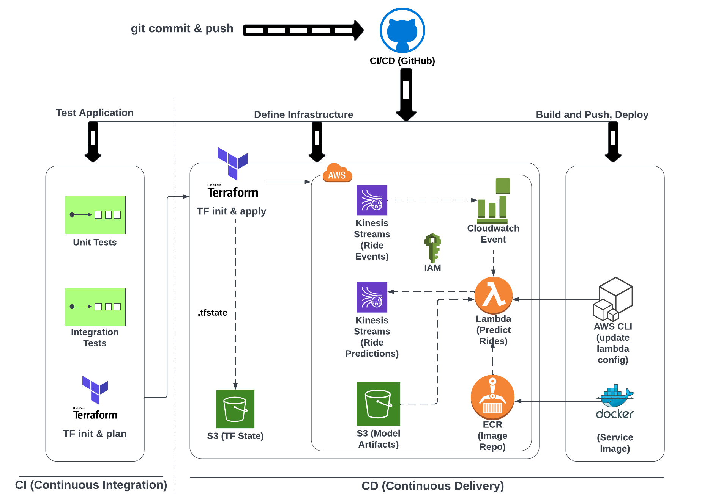

# 6. Best Practices

## Part A

(Part B below)

### 6.1 Testing Python code with pytest

### 6.2 Integration tests with docker-compose

### 6.3 Testing cloud services with LocalStack

### 6.4 Code quality: linting and formatting

### 6.5 Git pre-commit hooks

### 6.6 Makefiles and make

### 6.7 Homework

More information [here](../cohorts/2023/06-best-practices/homework.md).

### Notes

Did you take notes? Add them here:

* [Week 6a Notes by M. Ayoub C.](https://gist.github.com/Qfl3x/267d4cff36b58de67b4e33ca3fc9983f)
* [Week 6: Unit test/Integration test/Test Automation/Could service test with LocalStack/Code quality/Git pre-commit/Makefile by Hongfan (Amber)](https://github.com/Muhongfan/MLops/blob/main/06-best-practice/README.md)
* Send a PR, add your notes above this line

 

## Part B 
word
### Infrastructure-as-Code
with Terraform 

#### Summary
* Setting up a stream-based pipeline infrastructure in AWS, using Terraform
* Project infrastructure modules (AWS): Kinesis Streams (Producer & Consumer), Lambda (Serving API), S3 Bucket (Model artifacts), ECR (Image Registry)

Further info here:
* [Concepts of IaC and Terraform](docs.md#concepts-of-iac-and-terraform)
* [Setup and Execution](https://github.com/DataTalksClub/mlops-zoomcamp/tree/main/06-best-practices/code#iac)

#### 6B.1: Terraform - Introduction

https://www.youtube.com/watch?v=zRcLgT7Qnio&list=PL3MmuxUbc_hIUISrluw_A7wDSmfOhErJK&index=48

* Introduction
* Setup & Pre-Reqs
* Concepts of Terraform and IaC (reference material from previous courses)

#### 6B.2: Terraform - Modules and Outputs variables

https://www.youtube.com/watch?v=-6scXrFcPNk&list=PL3MmuxUbc_hIUISrluw_A7wDSmfOhErJK&index=49

* What are they?
* Creating a Kinesis module

#### 6B.3: Build an e2e workflow for Ride Predictions

https://www.youtube.com/watch?v=JVydd1K6R7M&list=PL3MmuxUbc_hIUISrluw_A7wDSmfOhErJK&index=50

* TF resources for ECR, Lambda, S3

#### 6B.4: Test the pipeline e2e

https://www.youtube.com/watch?v=YWao0rnqVoI&list=PL3MmuxUbc_hIUISrluw_A7wDSmfOhErJK&index=51

* Demo: apply TF to our use-case, manually deploy data dependencies & test
* Recap: IaC, Terraform, next steps

Additional material on understanding Terraform concepts here: [Reference Material](docs.md#concepts-of-iac-and-terraform)

 

### CI/CD
with GitHub Actions

#### Summary

* Automate a complete CI/CD pipeline using GitHub Actions to automatically trigger jobs 
to build, test, and deploy our service to Lambda for every new commit/code change to our repository.
* The goal of our CI/CD pipeline is to execute tests, build and push container image to a registry,
and update our lambda service for every commit to the GitHub repository.

Further info here: [Concepts of CI/CD and GitHub Actions](docs.md#concepts-of-ci-cd-and-github-actions)

#### 6B.5: CI/CD - Introduction

https://www.youtube.com/watch?v=OMwwZ0Z_cdk&list=PL3MmuxUbc_hIUISrluw_A7wDSmfOhErJK&index=52

* Architecture (Ride Predictions)
* What are GitHub Workflows?

#### 6B.6: Continuous Integration

https://www.youtube.com/watch?v=xkTWF9c33mU&list=PL3MmuxUbc_hIUISrluw_A7wDSmfOhErJK&index=53

* `ci-tests.yml`
    * Automate sections from tests: Env setup, Unit test, Integration test, Terraform plan
    * Create a CI workflow to trigger on `pull-request` to `develop` branch
    * Execute demo

#### 6B.7: Continuous Delivery

https://www.youtube.com/watch?v=jCNxqXCKh2s&list=PL3MmuxUbc_hIUISrluw_A7wDSmfOhErJK&index=54

* `cd-deploy.yml`
    * Automate sections from tests: Terraform plan, Terraform apply, Docker build & ECR push, Update Lambda config
    * Create a CD workflow to trigger on `push` to `develop` branch
    * Execute demo

#### Alternative CICD Solutions

* Using args and env variables in docker image, and leveraging makefile commands in cicd
    * Check the repo [README](https://github.com/Nakulbajaj101/mlops-zoomcamp/blob/main/06-best-practices/code-practice/README.md)
    * Using the args [Dockerfile](https://github.com/Nakulbajaj101/mlops-zoomcamp/blob/main/06-best-practices/code-practice/Dockerfile)
    * Using build args [ECR terraform](https://github.com/Nakulbajaj101/mlops-zoomcamp/blob/main/06-best-practices/code-practice/deploy/modules/ecr/main.tf)
    * Updating lambda env variables [Post deploy](https://github.com/Nakulbajaj101/mlops-zoomcamp/blob/main/06-best-practices/code-practice/deploy/run_apply_local.sh)
    * Making use of make file commands in CICD [CICD](https://github.com/Nakulbajaj101/mlops-zoomcamp/tree/main/.github/workflows)

### Notes

Did you take notes? Add them here:
* [Week 6 Best Practices: 2023](https://github.com/dimzachar/mlops-zoomcamp/tree/master/notes/Week_6)
* Send a PR, add your notes above this line
